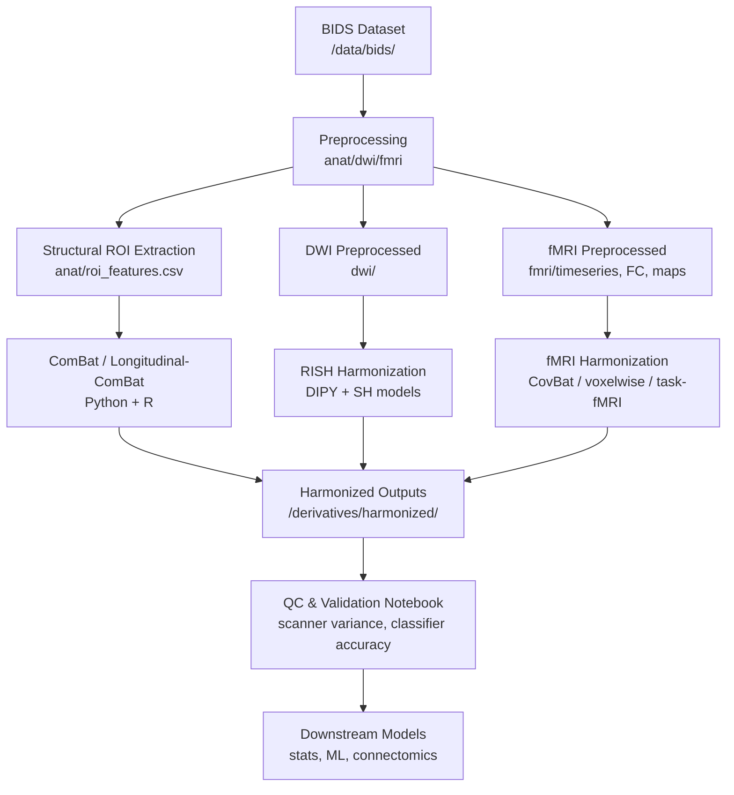

# Neuroimaging-Harmonization-Docker — An Environment for neuroimaging harmonization

A complete environment for **Multi-site neuroimaging harmonization**

This repository provides a **fully reproducible Docker image** and set of harmonization tools covering **structural MRI**, **diffusion MRI**, and **functional MRI** across scanners, protocols, and sites.

The system integrates:

- **Structural MRI harmonization**
  - ✔ Cross-sectional ComBat (Python / neuroHarmonize)
  - ✔ Longitudinal ComBat (R)  
- **Diffusion MRI harmonization**
  - ✔ RISH-based signal-level harmonization (DIPY + optional GPU acceleration)
  - ✔ MRtrix3 included for preprocessing + model fitting  
- **Functional MRI harmonization**
  - ✔ CovBat-style covariance harmonization for FC matrices  
  - ✔ Voxelwise fMRI ComBat (ALFF, fALFF, ReHo, ICA components, maps)  
  - ✔ Task-fMRI beta map harmonization (contrast-wise ComBat)  

Additionally, the environment provides:

- ✔ BIDS-compatible project layout  
- ✔ Standardized configuration (`project_config.yaml`)  
- ✔ Validation notebook + QC scripts (scanner variance reduction, biological-effect preservation)  
- ✔ A unified CLI (`harmonize.py`)  
- ✔ Makefile shortcuts (`make harmonize-struct`, `make harmonize-dmri-rish`, …)

---

## 🚀 Quickstart: Build & Run

### 1. Clone this repository

```bash
git clone https://github.com/<your-repo>/Neuroimaging-Harmonization-Docker.git
cd Neuroimaging-Harmonization-Docker
```

### 2. Build image with Docker Compose:

```bash
docker compose build

docker compose run --rm harmonize
```

## 🧠 Harmonization Workflow Overview



🧠 Included Harmonization Methods (Summary)
Structural MRI
| Method                       | Script             | Description                                                 |
| ---------------------------- | ------------------ | ----------------------------------------------------------- |
| **ComBat (cross-sectional)** | `run_combat.py`    | ROI harmonization across scanners                           |
| **Longitudinal ComBat**      | `run_longcombat.R` | Repeated-measures harmonization with subject random effects |


Diffusion MRI
| Method                                                | Script                  | Description                                       |
| ----------------------------------------------------- | ----------------------- | ------------------------------------------------- |
| **RISH (Rotationally Invariant Spherical Harmonics)** | `run_rish_harmonize.py` | Signal-level dMRI harmonization (ABCD/CHOP-style) |
| **MRtrix3 support**                                   | MRtrix built in Docker  | Preprocessing, tensor fitting, FODs               |


Functional MRI
| Method                               | Script                      | Description                                                           |
| ------------------------------------ | --------------------------- | --------------------------------------------------------------------- |
| **CovBat-style FC harmonization**    | `run_fmri_covbat.py`        | Covariance and mean harmonization of functional connectivity matrices |
| **Voxelwise fMRI ComBat**            | `run_fmri_voxel_combat.py`  | Harmonizes voxel intensities (ALFF, ReHo, ICA maps, etc.)             |
| **Task-fMRI beta-map harmonization** | `run_taskfmri_harmonize.py` | Contrast-level ComBat harmonization of beta images                    |


Validation
| Tool                        | Script                                    | Description                                                     |
| --------------------------- | ----------------------------------------- | --------------------------------------------------------------- |
| Structural MRI harmonization notebook | `notebooks/01_validation.ipynb` | modality validated pre/post                               |
| fMRI/FC QC pipeline         | `fmri_qc.py`                              | Scanner classifier, variance reduction, age-effect preservation |
| Functional MRI harmonization notebook | `notebooks/02_fmri_harmonize_notebook.ipynb` | modality validated pre/post    |


🛠 Unified Harmonization Interface (wrapper)
Run any pipeline via:
```bash
python scripts/harmonize.py --modality <struct|struct-long|dmri-rish|fmri-covbat|fmri-voxel|task-fmri|qc> ...
```

Example:
```bash
python scripts/harmonize.py \
  --modality fmri-covbat \
  --lookup config/scanners_lookup_fmri.csv \
  --matrices_dir derivatives/preproc/fmri/connectivity_matrices \
  --outdir derivatives/harmonized/fmri/fc_covbat \
  --do_combat
```

🧩 Makefile Shortcuts
```bash
make harmonize-struct
make harmonize-struct-long
make harmonize-dmri-rish
make harmonize-fmri-covbat
make harmonize-fmri-voxel
make harmonize-taskfmri
make qc-fmri
```

 ## Project Folder Structure

```markdown
/data/
├─ bids/ # raw BIDS dataset (mounted or symlinked)
└─ harmonize_project/
    ├─ derivatives/
    │    ├─ preproc/
    │    │    ├─ fmri/
    │    │    │    ├─ parc_timeseries/         # parcellated fMRI timeseries
    │    │    │    ├─ connectivity_matrices/   # N×N FC matrices (per subject)
    |    |    |    └─ beta_maps/               # beta 4D or beta_nifti per subject
    │    │    ├─ anat/
    │    │    └─ dwi/
    │    └─ harmonized/
    │         ├─ fmri/
    │         │    ├─ fc_combat/               # harmonized FC matrices
    │         │    ├─ alff_combat/
    │         │    ├─ reho_combat/
    │         │    └─ ica_maps_combat/
    │         ├─ structural/
    │         └─ dwi_rish/
    ├─ config/
    │    ├─ project_config.yaml
    │    ├─ scanners_lookup.csv
    |    └─ scanners_lookup_fmri.csv
    ├─ scripts/
    └─ notebooks/    

